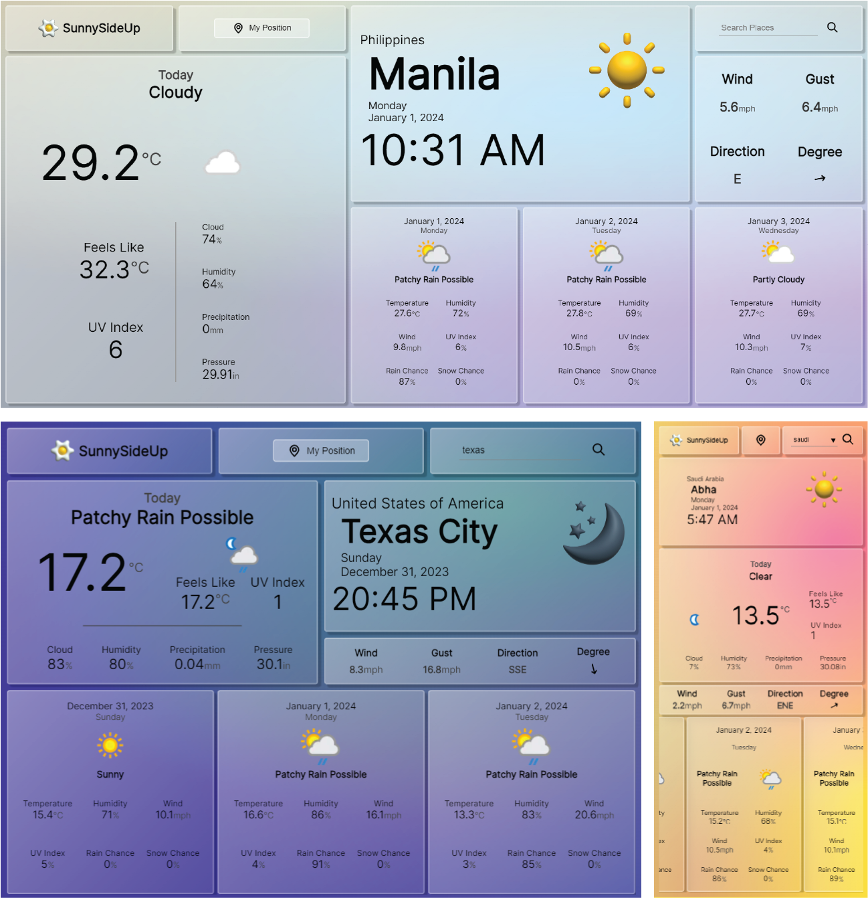

# SunnySideUp: A Weather App

“SunnySideUp” is a project inspired by the Odin Project. The primary purpose of this project is for practice and learning. It serves as a platform for me to apply, enhance, and reflect on various technical concepts and skills. This journey of learning and growth is open for viewing and I welcome any constructive feedback or suggestions. Enjoy exploring SunnySideUp! 😊

__[Live Demo](https://cj-cepe.github.io/sunny-side-up/)__

## Technologies Used: 
* __APIs:__ Realtime API, Forecast API, & Search/Autocomplete API from [WeatherAPI.com](https://www.weatherapi.com/) (Free Tier)
    * Realtime weather, 1 million calls per month, & 3 day forecast
* __Web Technologies:__ HTML, CSS, JS
    * Webpack, Babel _(supporting browsers with “>0.25%” usage)_
    * eslint, prettier 
    * jest _(included in the project setup, although it hasn’t been utilized yet)_
* __Design Tools:__ Figma & Adobe Illustrator
    
## Features:
* __Location-Based Weather and Time:__ The application allows users to search for a specific location and displays the current time and weather conditions for that area. This information is updated every 5 minutes to ensure accuracy.
* __Dynamic Visual Elements:__ The application’s background gradient color shifts based on the prevailing weather conditions. Additionally, the displayed icon adjusts to reflect whether it’s day or night, providing a more intuitive user experience.

## Future Improvements: 
* __Dynamic Font Sizing:__ Plan to introduce a feature that dynamically adjusts the font size based on the length of the text and the size of its container. This is intended to prevent content overflow, particularly when larger font sizes are used.
* __Improved Responsiveness:__ Aim to enhance the application’s responsiveness across a variety of screen sizes, ensuring a consistent user experience on all devices.
* __Expanded Testing and Error Handling:__ Intend to increase the scope of testing and bolster error handling mechanisms to improve the application’s reliability and robustness.
* __Icon Redesign:__ Plan to redesign the icons for better image quality, moving away from the default icons provided by the API.
3D Icons: Exploring the possibility of using 3D images for icons to enhance the visual appeal of the application.
* __API Key Security:__ Plan to move the API key to the backend to enhance security, as it is currently exposed on the frontend.
